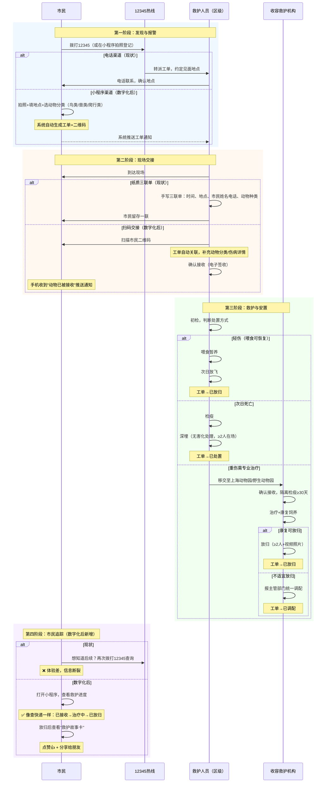
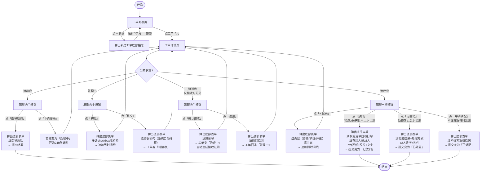
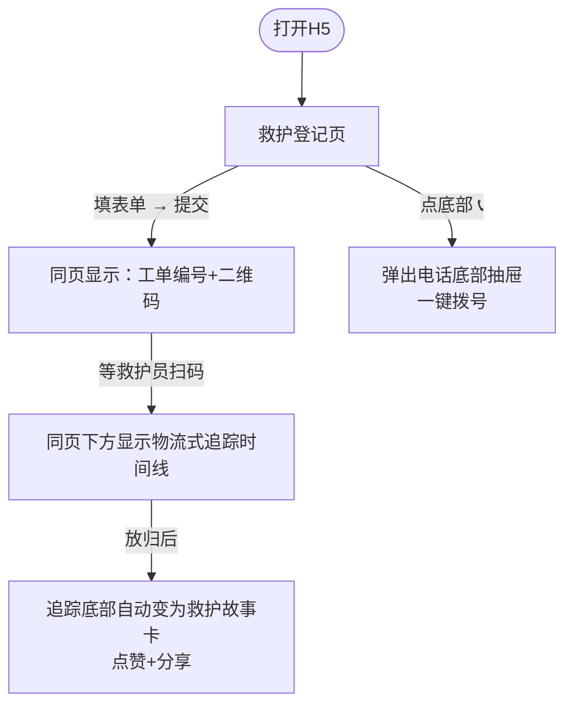
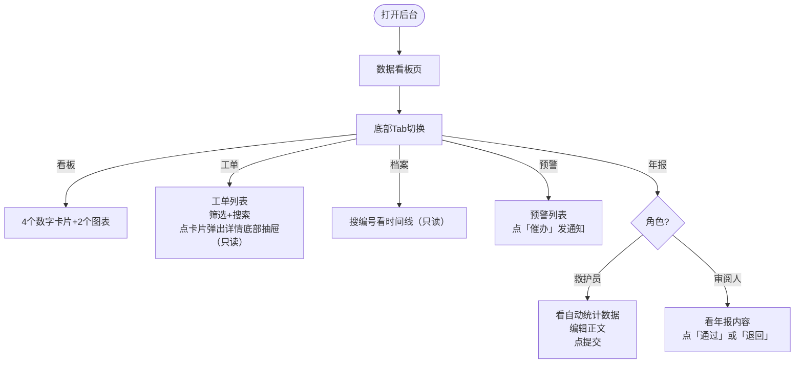

# PRD：上海市陆生野生动物收容救护管理平台（H5版）

**产品类型：平台型** | **版本**：v4.0（极简8页版） | **日期**：2026-06-09
**需求来源**：《上海市陆生野生动物收容救护工作指南（试行）》（沪绿容〔2021〕236号）

---

## 1. 背景与目标

上海市绿化和市容管理局2021年发布该工作指南，规定收容救护须覆盖接收→初检→移交→治疗检疫→安置全流程，涉及6类角色。当前以电话+纸质表格为主，三个核心痛点：工单跨角色流转容易断链、24h响应/30天检疫等时间约束靠人记、年度汇总靠手工。

**产品目标**：用H5网页把工单流转和合规计时管起来。三个端——救护工作台H5（手机为主）、管理后台H5（手机+PC自适应）、市民端H5（手机）。

**成功指标**：上线6个月后工单系统使用率≥90%；24h响应超时率≤5%；年报按时提交率100%。

### 1.1 动物分类

所有工单和动物记录须标注动物大类，共三类：

| 分类 | 典型物种（上海常见） | 救助特点 |
|------|-------------------|---------|
| 鸟类 | 白鹭、红隼、珠颈斑鸠、麻雀、猫头鹰 | 占比最高（约60%），多为撞伤/幼鸟坠落，轻伤喂食后次日即可放飞的比例高 |
| 兽类 | 刺猬、黄鼬、蝙蝠、貉 | 多有攻击性风险，需防护工具；部分为误入城区，健康个体可直接放归 |
| 爬行类 | 蛇（乌梢蛇/王锦蛇）、龟（乌龟/巴西龟）、蜥蜴 | 夏季高发；龟类多为市民弃养，需判断是否本土物种；蛇类需专业抓捕 |

新建工单时，"动物分类"为必填项（三选一），用于统计分析和数据看板分组。

---

## 2. 角色与权限

| 角色 | 谁在用 | 能干什么 | 看什么数据 |
|------|--------|---------|-----------|
| 救护员 | 区级管理机构、收容救护机构、临时救护点的人 | 建单、填记录、移交、放归、无害化 | 本机构的工单和档案 |
| 监管员 | 市/区两级主管部门和管理机构的人 | 看数据、审年报、处理预警 | 市级看全市，区级看辖区 |
| 审阅人 | 市/区主管部门负责人 | 年报通过或退回 | 全市/辖区年报 |
| 市民 | 公众 | 提交求助、查进度、看电话 | 只看自己的工单 |

---

## 3. 文件要求 → 产品解法

| 文件要求 | 来源 | 怎么做 |
|---------|------|--------|
| 上门≤24h | 第四条（一） | 建单开始计时，20h变黄，24h变红+通知上级 |
| 检疫≥30天 | 第四条（四） | 录入检疫开始日期后，未满30天"放归"按钮不出现 |
| 年报12.15/12.30 | 第五条（四） | 12月1日自动生成年报草稿+推送，12月10日再催一次 |
| 档案保存≥3年 | 第五条（三） | 处置后3年内档案锁定不可删除 |
| 编号规则 | 附件2 | 系统自动生成：区代码+日期+顺序号 |
| 放归≥2人+视频照片文字 | 第四条（五） | 放归表单必填≥2人+必传视频照片文字，缺一不可提交 |
| 无害化≥2人 | 第四条（五） | 同上 |
| 不放生外来物种 | 第三条 | 外来物种（is_native=否）不显示放归按钮 |
| 不用于商业谋利 | 第四条（五） | 在养动物只有放归/调配/无害化三个出口，都留痕 |

---

## 4. 功能清单

### 4.1 救护工作台（H5，救护员用）

| # | 功能 | 一句话 | 优先级 |
|---|------|--------|--------|
| R1 | 工单列表 | 分"待办/已办"两栏，待办按紧急度排序，超时标红 | P0 |
| R2 | 新建工单 | 6个字段：电话、动物分类（鸟类/兽类/爬行类）、物种、地点、伤病、是否本土 | P0 |
| R2b | 扫码接收 | 扫描市民二维码，自动关联工单，填入动物信息，进入确认接收流程 | P0 |
| R3 | 工单处理 | 一个页面搞定全流程：顶部信息卡+中间时间线+底部操作按钮（随状态变化） | P0 |
| R4 | 动物档案 | 搜编号或物种，看时间线 | P0 |
| R5 | 接收证明 | 移交后自动生成，点一下就下载三联PDF | P0 |
| R6 | 疫病上报 | 关联动物+描述疫病+提交，自动通知上级 | P0 |
| R7 | 年度报表 | 自动汇总数据+编辑正文+提交 | P0 |

### 4.2 管理后台（H5自适应，监管员用）

| # | 功能 | 一句话 | 优先级 |
|---|------|--------|--------|
| M1 | 数据看板 | 4个数字卡片+2个图表，市级看全市/区级看辖区 | P0 |
| M2 | 工单查阅 | 列表+筛选，只读 | P0 |
| M3 | 档案查阅 | 搜编号看时间线，只读 | P0 |
| M4 | 预警中心 | 三类预警（超时/检疫/年报），一键催办 | P0 |
| M5 | 年报编制与审阅 | 统计数据+正文编辑+通过/退回 | P0 |
| M6 | 机构通讯录 | 维护机构名称地址电话代码 | P0 |

### 4.3 市民端（小程序/H5）

| # | 功能 | 一句话 | 优先级 |
|---|------|--------|--------|
| C1 | 拍照登记 | 现场拍照+填地点/伤病，提交后生成工单和专属二维码 | P0 |
| C2 | 扫码交接 | 救护人员扫市民二维码，自动关联工单，市民收到"已接收"通知 | P0 |
| C3 | 物流式追踪 | 像查快递一样看救护进度：已接收→治疗中→已放归，每步有时间和照片 | P0 |
| C4 | 点赞分享 | 放归后展示"救护故事卡"（动物照片+救护过程+放归照片），可点赞和分享 | P1 |
| C5 | 救护电话 | 12345热线 + 各区救护联系电话，一键拨打 | P0 |

---

## 5. 交互流程图（Mermaid）

### 5.0 业务流程泳道图（现状 → 数字化后）

以下泳道图展示**实际业务全流程**，覆盖从市民发现受伤动物到最终安置的完整路径，以及数字化后每个环节的交互方式。



**泳道图要点说明**：

- **12345热线**是当前主入口，数字化后保留电话渠道的同时，新增小程序入口让市民可以直接拍照登记
- **动物分类**（鸟类/兽类/爬行类）在现场交接时确认，是工单和统计的核心字段
- **三种安置结局**对应实际业务的三种常见场景：轻伤放飞、死亡深埋、重伤送治
- **市民追踪**是数字化后的核心体验升级：从"再打12345问"变成"随时查进度+点赞分享"

### 5.1 救护工作台——完整交互路径

下面这张图展示救护员从建单到结案的所有操作路径，以及每一步的界面交互方式：



**交互要点**：
- 所有操作表单统一用**底部弹出抽屉**（bottom sheet），不跳转新页面，用完收起
- 工单详情页的时间线自动追加每条记录，按时间倒序排列
- 底部操作按钮**根据状态动态显示**，不该出现的按钮看不到（比如检疫没满30天就看不到放归按钮）

### 5.2 市民端交互流程



### 5.3 管理后台交互流程



---

## 6. H5页面结构说明（共8个页面）

> **页面精简策略**：救护工作台4页 + 管理后台2页 + 市民端2页 = 8页。所有操作表单统一用底部弹出抽屉（bottom sheet），不跳转新页面。新建工单、档案详情、电话列表、疫病上报等均以内嵌抽屉或折叠面板实现，功能全保留，页面交互最少。

### 6.1 救护工作台（4个页面）

底部Tab栏：**工单** | **档案** | **我的**

---

**页面1：工单列表**（Tab首页，含新建工单底部抽屉）

```
┌─────────────────────────┐
│  救护工作台          🔔   │  ← 顶部栏，🔔有预警时显示红点
├─────────────────────────┤
│  [待办(12)]  [已办]      │  ← 两个Tab切换
├─────────────────────────┤
│  ┌───────────────────┐  │
│  │🔴 FX260609003      │  │  ← 超时工单红色左边框
│  │白鹭 · 浦东          │  │
│  │待响应 · 已超24h     │  │
│  └───────────────────┘  │
│  ┌───────────────────┐  │
│  │ FX260609002        │  │  ← 正常工单
│  │猕猴 · 奉贤          │  │
│  │治疗中 · 第12天      │  │
│  └───────────────────┘  │
│  ┌───────────────────┐  │
│  │ FX260609001        │  │
│  │ ...                │  │
│  └───────────────────┘  │
│                         │
│              [+ 新建]    │  ← 右下角悬浮按钮，点→弹出新建底部抽屉
├─────────────────────────┤
│  📋工单    📁档案   👤我的│  ← 底部Tab
└─────────────────────────┘
```

**新建工单底部抽屉**（点 + 按钮弹出，不跳页）：

```
┌─────────────────────────┐
│  ═══  (拖拽条)           │
│  新建工单           ✕    │
├─────────────────────────┤
│  联系电话 *              │
│  ┌───────────────────┐  │
│  │ 138xxxx1234       │  │
│  └───────────────────┘  │
│  动物分类 *              │
│  [🐦鸟类] [🦊兽类] [🐍爬行类] │
│  物种名称 *              │
│  ┌───────────────────┐  │
│  │ 白鹭        🔍    │  │  ← 输入时可搜索物种库
│  └───────────────────┘  │
│  发现地点 *              │
│  ┌───────────────────┐  │
│  │ 浦东新区世纪大道   │  │
│  └───────────────────┘  │
│  伤病情况 *              │
│  [受伤] [生病] [染疫]    │
│  [攻击性] [健康] [不明]  │
│  是否本土 *              │
│  (●是)  (○否)  (○不确定) │
│  照片                    │
│  ┌────┐                 │
│  │ 📷 │                 │
│  └────┘                 │
│  ┌───────────────────┐  │
│  │      提 交         │  │
│  └───────────────────┘  │
└─────────────────────────┘
```

- **用途**：日常工作入口 + 快速建单
- **交互**：点卡片→进工单详情（页面2）；点+→弹出新建抽屉→填5个必填项→提交→抽屉收起，新工单置顶
- **编号自动生成**，用户不需要填
- **扫码接收**：工单列表页顶部增加「📷扫码」按钮，点击调起摄像头扫描市民二维码，扫码后自动弹出"确认接收"底部抽屉

---

**页面2：工单详情**（核心页面，含所有操作 + 疫病上报）

```
┌─────────────────────────┐
│  ← FX260609003    待响应 │  ← 返回+编号+状态色块
├─────────────────────────┤
│  📍 浦东新区世纪大道100号 │
│  🐦 白鹭 · 国家一级      │
│  📞 138xxxx1234          │
│  🕐 创建于 6/9 09:00     │
│  ⏱ 已用时 20h ⚠️        │  ← 接近24h黄色提示
├─────────────────────────┤
│  ── 操作记录 ──          │
│                         │
│  ● 6/9 09:00 创建工单    │  ← 时间线
│  │  来源：市民来电        │
│  │                      │
│  ○ 暂无更多记录          │
│                         │
├─────────────────────────┤
│ ┌────────┐ ┌──────────┐ │
│ │指导放归 │ │ 上门接收  │ │  ← 底部固定操作按钮
│ └────────┘ └──────────┘ │     根据当前状态动态变化
│                [🦠上报]  │  ← 右上角疫病上报入口
└─────────────────────────┘
```

- **用途**：一个页面完成全部操作（初检/移交/接收/记录/放归/无害化/调配/疫病上报）
- **时间线区域**：每做一次操作，时间线自动追加一条记录，按时间倒序排列
- **底部按钮**：根据状态显示不同按钮，所有操作表单都是底部弹出抽屉（共6种，见下方）
- **疫病上报**：详情页右上角「🦠上报」按钮，点击弹出底部抽屉（关联当前动物+描述疫病+提交），自动通知上级

**操作表单（底部弹出抽屉，共6种）**：

所有操作表单从底部弹出，不跳转页面。以下列出每种表单的字段：

**(a) 初检记录**

```
┌─────────────────────────┐
│  初检记录           ✕    │
├─────────────────────────┤
│  精神状况 *              │
│  [正常][跛脚][缩脖][垂翅] │  ← 多选chip
│  [颤抖][昏迷]            │
│  呼吸 *                  │
│  [正常][快][慢][深]       │
│  [张口][杂音][失声]       │
│  骨骼 *                  │
│  (●正常)(○不对称)        │
│  (○开放性骨折)(○粉碎性)   │
│  体重(kg)                │
│  ┌────────┐             │
│  │  1.5   │             │
│  └────────┘             │
│  结论 *                  │
│  ┌───────────────────┐  │
│  │ 体况良好，建议移交  │  │
│  └───────────────────┘  │
│  ┌───────────────────┐  │
│  │      保 存         │  │
│  └───────────────────┘  │
└─────────────────────────┘
```

**(b) 移交**

```
┌─────────────────────────┐
│  移交              ✕    │
├─────────────────────────┤
│  系统推荐接收机构：       │
│  ┌───────────────────┐  │
│  │ ● 上海动物园       │  │  ← 国家重点保护自动推荐
│  │   长宁区虹桥路     │  │     非国家重点推荐临时点
│  ├───────────────────┤  │
│  │ ○ 上海野生动物园   │  │
│  │   浦东南六公路     │  │
│  └───────────────────┘  │
│  备注                    │
│  ┌───────────────────┐  │
│  │                   │  │
│  └───────────────────┘  │
│  ┌───────────────────┐  │
│  │     确认移交       │  │
│  └───────────────────┘  │
└─────────────────────────┘
```

**(c) 确认接收**

```
┌─────────────────────────┐
│  确认接收           ✕    │
├─────────────────────────┤
│  笼舍号 *                │
│  ┌───────────────────┐  │
│  │ A-03              │  │
│  └───────────────────┘  │
│  检疫隔离开始日期 *       │
│  ┌───────────────────┐  │
│  │ 2026-06-09        │  │  ← 日期选择器
│  └───────────────────┘  │
│  ┌───────────────────┐  │
│  │     确认接收       │  │
│  └───────────────────┘  │
└─────────────────────────┘
```

**(d) 放归**

```
┌─────────────────────────┐
│  放归登记           ✕    │
├─────────────────────────┤
│  放归条件检查：           │
│  ✅ 检疫隔离已满30天     │  ← 系统自动校验打勾
│  ✅ 本土物种             │     不满足的项标红
│  ❌ 在场人员（需≥2人）   │     阻断提交
│  放归地点 *              │
│  ┌───────────────────┐  │
│  │ 崇明东滩          │  │
│  └───────────────────┘  │
│  在场人员 *              │
│  ┌───────────────────┐  │
│  │ 张三(001)         │  │
│  │ 李四(002)         │  │  ← 至少2行
│  └───────────────────┘  │
│  [+ 添加人员]            │
│  视频 *   [📎上传]       │
│  照片 *   [📎上传]       │
│  文字记录 *              │
│  ┌───────────────────┐  │
│  │ 动物状态良好...    │  │
│  └───────────────────┘  │
│  ┌───────────────────┐  │
│  │     提交放归       │  │
│  └───────────────────┘  │
└─────────────────────────┘
```

**(e) 无害化处理**

```
┌─────────────────────────┐
│  无害化处理         ✕    │
├─────────────────────────┤
│  检疫结果 *              │
│  (●不合格)(○无法检疫)    │
│  (○合格→引导走调配)     │
│  处理方式 *              │
│  ┌───────────────────┐  │
│  │ 深埋              │  │
│  └───────────────────┘  │
│  处理地点 *              │
│  ┌───────────────────┐  │
│  │                   │  │
│  └───────────────────┘  │
│  处理人员 *（≥2人）      │
│  ┌───────────────────┐  │
│  │ 张三(001)         │  │
│  │ 李四(002)         │  │
│  └───────────────────┘  │
│  附件 *   [📎上传]       │
│  ┌───────────────────┐  │
│  │     提交           │  │
│  └───────────────────┘  │
└─────────────────────────┘
```

**(f) 申请调配**

```
┌─────────────────────────┐
│  申请调配           ✕    │
├─────────────────────────┤
│  不适宜放归原因 *         │
│  ┌───────────────────┐  │
│  │ 翅膀永久性损伤，   │  │
│  │ 丧失飞行能力       │  │
│  └───────────────────┘  │
│  ┌───────────────────┐  │
│  │     提交申请       │  │
│  └───────────────────┘  │
└─────────────────────────┘
```

---

**页面3：动物档案**（Tab第二栏，列表+详情底部抽屉合一）

```
┌─────────────────────────┐
│  动物档案                │
├─────────────────────────┤
│  ┌───────────────────┐  │
│  │ 🔍 搜编号或物种名  │  │
│  └───────────────────┘  │
│  ┌───────────────────┐  │
│  │ SD260609001       │  │  ← 点卡片→弹出详情底部抽屉
│  │ 白鹭 · 在养       │  │
│  │ 笼舍A-03          │  │
│  └───────────────────┘  │
│  ┌───────────────────┐  │
│  │ SD260609002       │  │
│  │ 猕猴 · 已放归     │  │
│  └───────────────────┘  │
├─────────────────────────┤
│  📋工单    📁档案   👤我的│
└─────────────────────────┘
```

**档案详情底部抽屉**（点卡片弹出）：

```
┌─────────────────────────┐
│  ═══  (拖拽条)           │
│  SD260609001        ✕    │
├─────────────────────────┤
│  🐦 白鹭 · 国家一级      │
│  雌性 · 成体 · 笼舍A-03 │
│  状态：治疗中（第15天）   │
│  检疫：6/1 - 7/1        │
├─────────────────────────┤
│  ── 健康档案 ──          │
│  ● 6/9 初检             │
│  │ 精神正常，呼吸正常   │
│  │ 体重1.5kg            │
│  ● 6/9 诊断             │
│  │ 左翅骨折             │
│  │ 方案：夹板固定+消炎   │
│  ● 6/10 护理            │
│  │ 换药，喂食小鱼500g    │
│  ● 6/10 体重 1.52kg     │
│  ○ ...更多记录           │
│  [+ 添加记录]            │
└─────────────────────────┘
```

- **用途**：搜索查看动物健康档案
- **交互**：搜索栏→输入编号或物种→列表筛选；点卡片→底部抽屉弹出详情→抽屉内可点"+ 添加记录"

---

**页面4：我的**（Tab第三栏，含年报/通讯录/预警/消息折叠面板）

```
┌─────────────────────────┐
│  我的                    │
├─────────────────────────┤
│  上海动物园              │
│  救护员：张三            │
│                         │
│  ───────────────────    │
│  ▼ 📊 年度报表           │  ← 折叠面板，点展开
│  ┌───────────────────┐  │
│  │ 2026年 · 草稿      │  │
│  │ 自动统计：工单342件 │  │
│  │ 放归156 · 处置41   │  │
│  │ [编辑正文] [提交]   │  │
│  └───────────────────┘  │
│                         │
│  ▶ 📞 机构通讯录         │  ← 折叠面板，点展开看列表
│  ▶ ⚠️ 预警中心  (3)      │  ← 折叠面板，红点显示数量
│  ▶ 🔔 消息通知           │  ← 折叠面板
│                         │
├─────────────────────────┤
│  📋工单    📁档案   👤我的│
└─────────────────────────┘
```

- **用途**：个人信息 + 年报编制 + 通讯录 + 预警 + 消息，一页搞定
- **交互**：折叠面板点击展开/收起；年报展开后显示自动统计数据+编辑正文+提交按钮；预警展开显示预警列表+催办按钮；通讯录展开显示机构列表+一键拨号；消息展开显示通知列表

---

### 6.2 管理后台（H5自适应，2个页面）

底部Tab栏：**看板** | **工单** | **档案** | **预警** | **年报**

---

**页面1：数据看板**（Tab首页，含统计+快捷入口）

```
┌─────────────────────────┐
│  管理后台         2026年 │
├─────────────────────────┤
│ ┌────┐┌────┐┌────┐┌────┐│
│ │342 ││ 28 ││156 ││ 41 ││
│ │工单 ││在养 ││放归 ││处置 ││
│ └────┘└────┘└────┘└────┘│
│                         │
│  各区工单量              │
│  浦东 ████████ 89       │
│  奉贤 ██████ 67         │
│  崇明 █████ 52          │
│  ...                    │
│                         │
│  处置方式分布            │
│  [饼图：放归/调配/       │
│   无害化/在养]           │
├─────────────────────────┤
│ 看板 工单 档案 预警 年报 │
└─────────────────────────┘
```

- **看板Tab**：4个数字卡片 + 各区工单量柱状图 + 处置方式饼图，市级看全市/区级看辖区
- **工单Tab**：列表+筛选+搜索，点卡片弹出详情底部抽屉（只读），交互与救护工作台详情页一致但无操作按钮
- **档案Tab**：搜编号看时间线（只读），交互与救护工作台档案页一致
- **预警Tab**：三类预警列表（超时/检疫/年报），每行右侧「催办」按钮，点→发通知，按钮变"已催办"

---

**页面2：年报编制与审阅**（Tab第五栏）

```
┌─────────────────────────┐
│  年报 · 2026年           │
├─────────────────────────┤
│  自动统计数据：           │
│  工单总量342 · 放归156   │
│  处置41 · 调配22 · 在养28│
│                         │
│  ── 年报正文 ──          │
│  ┌───────────────────┐  │
│  │ 一、基本情况...    │  │  ← 富文本编辑区
│  │ 二、收容救护情况   │  │
│  │ 三、存在问题       │  │
│  └───────────────────┘  │
│                         │
│  ┌─────────┐ ┌───────┐  │
│  │ 保存草稿 │ │ 提交  │  │  ← 救护员操作
│  └─────────┘ └───────┘  │
│  ┌─────────┐ ┌───────┐  │
│  │ 退回    │ │ 通过  │  │  ← 仅审阅人可见
│  └─────────┘ └───────┘  │
├─────────────────────────┤
│ 看板 工单 档案 预警 年报 │
└─────────────────────────┘
```

- **用途**：年度报表编制和审阅
- **交互**：自动汇总当年统计数据→救护员编辑正文→保存草稿或提交→审阅人看到后通过或退回
- **时间提醒**：12月1日自动生成年报草稿+推送提醒，12月10日未提交再催一次

---

### 6.3 市民端（小程序/H5，2个页面）

---

**页面1：救助登记 + 追踪**（核心页面，表单+二维码+物流追踪合一）

**状态A：初始表单**

```
┌─────────────────────────┐
│  🦜 野生动物救护          │
├─────────────────────────┤
│  发现野生动物需要帮助？   │
│  拍照登记，扫码即可交接   │
├─────────────────────────┤
│  拍照 *                  │
│  ┌────┐ ┌────┐ ┌────┐  │
│  │ 📷 │ │ 📷 │ │ 📷 │  │
│  └────┘ └────┘ └────┘  │
│  动物分类 *              │
│  [🐦鸟类] [🦊兽类] [🐍爬行类] │
│  发现地点 *              │
│  ┌───────────────────┐  │
│  │ 📍自动定位，可修改  │  │
│  └───────────────────┘  │
│  动物怎么了？*           │
│  [受伤] [生病] [正常]    │
│  [不确定]                │
│  联系电话 *              │
│  ┌───────────────────┐  │
│  │                   │  │
│  └───────────────────┘  │
│  ┌───────────────────┐  │
│  │    提交求助         │  │
│  └───────────────────┘  │
└─────────────────────────┘
```

**状态B：提交后显示二维码**（同页滚动，不跳页）

```
┌─────────────────────────┐
│  ✅ 提交成功              │
├─────────────────────────┤
│  工单编号：XH260609001   │
│  ┌───────────────────┐  │
│  │    [QR二维码]      │  │
│  └───────────────────┘  │
│  救护人员到达后扫描此码   │
│  即可交接，您会收到通知   │
│  [保存到相册]             │
├─────────────────────────┤
│  ── 救护进度 ──          │
│  ✅ 已提交               │
│  │ 6/9 09:00            │
│  ○ 已接收               │
│     等待救护人员...      │
│  ○ 治疗中               │
│  ○ 已放归               │
└─────────────────────────┘
```

**状态C：救护员扫码后，追踪时间线自动更新**

```
┌─────────────────────────┐
│  🐦 白鹭 · XH260609001  │
├─────────────────────────┤
│  ✅ 已提交               │
│  │ 6/9 09:00            │
│  │ 您已拍照登记           │
│  ✅ 已接收               │
│  │ 6/9 10:30            │
│  │ 救护人员张三已到达现场  │
│  │ 📷 [现场照片]         │
│  🔄 治疗中               │
│  │ 6/9 14:00            │
│  │ 已送至上海动物园       │
│  │ 诊断：左翅骨折        │
│  │ 📷 [治疗照片]         │
│  ○ 已放归               │
│     等待康复后放归...     │
├─────────────────────────┤
│  📞 联系救护人员          │
└─────────────────────────┘
```

**状态D：放归后，追踪底部变为救护故事卡**

```
┌─────────────────────────┐
│  🐦 白鹭 · XH260609001  │
├─────────────────────────┤
│  ✅ 已提交 → ✅ 已接收    │
│  → ✅ 治疗中 → ✅ 已放归 │
│  (完整时间线)            │
├─────────────────────────┤
│  🎉 救护成功！            │
│  ┌───────────────────┐  │
│  │  [放归照片]        │  │
│  └───────────────────┘  │
│  🐦 白鹭                 │
│  2026年6月9日救助        │
│  左翅骨折→上海动物园     │
│  治疗35天→康复放归       │
│  放归地点：崇明东滩       │
│     👍 128    💬 分享     │
│  ── 市民留言 ──          │
│  "感谢救护人员，辛苦了！" │
└─────────────────────────┘
```

- **用途**：一个页面完成 拍照登记→二维码→物流式追踪→救护故事卡 全流程
- **交互**：
  - 初始状态显示表单→提交后表单收起，同页显示二维码+追踪时间线（初始状态）
  - 救护员扫码后，时间线自动追加节点（像查快递一样刷新）
  - 放归后，时间线最底部自动展示救护故事卡（含点赞+分享+留言）
  - 重复提交检测：5分钟内同一电话重复提交，弹出确认"您近期已提交过（编号XXX），是否仍需提交？"

**底部固定入口**：

```
│  📞 拨打12345电话求助    │  ← 底部常驻，点击弹出电话列表底部抽屉
│  📞 各区救护联系电话     │     含12345热线+各区救护电话，一键拨号
```

---

**页面2：救护电话**（底部弹出抽屉，点页面底部电话按钮弹出）

```
┌─────────────────────────┐
│  救护电话           ✕    │
├─────────────────────────┤
│  ┌───────────────────┐  │
│  │ 📞 12345市民热线   │  │  ← 置顶
│  └───────────────────┘  │
│  上海动物园              │
│  📞 62689517            │  ← 一键拨号
│  长宁区虹桥路2381号      │
│  上海野生动物园           │
│  📞 58035522            │
│  浦东南六公路178号       │
│  ── 各区救护电话 ──      │
│  徐汇区 📞 54483886     │
│  奉贤区 📞 67193592     │
│  ...                    │
└─────────────────────────┘
```

---

## 7. 核心数据表（中文命名）

### 7.1 工单表

| 字段名 | 必填 | 类型 | 说明 |
|-------|:---:|------|------|
| 工单编号 | ✓ | 文本 | 区代码+日期+顺序号，如FX20260609003 |
| 来源 | ✓ | 枚举 | 电话/小程序/罚没/巡护 |
| 联系电话 | ✓ | 文本 | 来电人电话 |
| 动物分类 | ✓ | 枚举 | 鸟类/兽类/爬行类 |
| 物种名称 | ✓ | 文本 | 中文名或形态描述 |
| 保护级别 | ✓ | 枚举 | 国家一级/二级/市重点/三有/CITES附录I/II/一般物种 |
| 是否本土 | ✓ | 枚举 | 是/否/不确定 |
| 发现地点 | ✓ | 文本 | 地点描述 |
| 所属区 | ✓ | 文本 | 行政区划代码 |
| 伤病情况 | ✓ | 枚举 | 受伤/生病/疑似染疫/有攻击性/健康/不明 |
| 状态 | ✓ | 枚举 | 待响应/处理中/待接收/治疗中/已放归/已调配/已处置/无需救护/已结案 |
| 当前机构 | ✓ | 文本 | 当前负责机构名称 |
| 创建时间 | ✓ | 时间 | 系统自动 |
| 上门时间 | — | 时间 | 上门接收时记录 |
| 照片 | — | 文件 | 动物照片 |
| 二维码 | — | 文本 | 小程序提交时自动生成的工单二维码（用于扫码交接） |

### 7.2 动物表

| 字段名 | 必填 | 类型 | 说明 |
|-------|:---:|------|------|
| 动物编号 | ✓ | 文本 | 机构代码+日期+顺序号 |
| 关联工单 | ✓ | 文本 | 关联的工单编号 |
| 物种 | ✓ | 文本 | 物种名称 |
| 性别 | — | 枚举 | 雄/雌/不明 |
| 年龄段 | — | 枚举 | 幼体/亚成体/成体/不明 |
| 笼舍号 | ✓ | 文本 | 个体可识别标识 |
| 动物状态 | ✓ | 枚举 | 在养/已放归/已调配/已死亡 |
| 检疫开始日期 | — | 日期 | 隔离检疫起始日期 |
| 接收日期 | ✓ | 日期 | 机构接收日期 |
| 处置日期 | — | 日期 | 最终安置日期 |

### 7.3 健康记录表（初检/诊断/护理/体重合一）

| 字段名 | 必填 | 类型 | 说明 |
|-------|:---:|------|------|
| 记录编号 | ✓ | 文本 | 自动生成 |
| 关联动物 | ✓ | 文本 | 动物编号 |
| 记录类型 | ✓ | 枚举 | 初检/诊断/护理/体重 |
| 记录时间 | ✓ | 时间 | 操作时间 |
| 操作人 | ✓ | 文本 | 姓名 |
| 记录内容 | ✓ | 文本 | 根据类型不同内容不同（见下方说明） |

**各类型的记录内容**：

- **初检**：精神状况、呼吸、骨骼、损伤描述、体重、体温、结论
- **诊断**：症状、治疗方案、检疫开始日期、检疫结束日期
- **护理**：治疗记录、饲料种类、喂养方法
- **体重**：体重数值(kg)

### 7.4 处置记录表（放归/无害化/调配合一）

| 字段名 | 必填 | 类型 | 说明 |
|-------|:---:|------|------|
| 记录编号 | ✓ | 文本 | 自动生成 |
| 关联动物 | ✓ | 文本 | 动物编号 |
| 处置类型 | ✓ | 枚举 | 放归/无害化处理/调配 |
| 处置时间 | ✓ | 时间 | 操作时间 |
| 操作人员 | ✓ | 文本 | ≥2人（放归和无害化时校验） |
| 地点 | — | 文本 | 放归/处理地点 |
| 检疫结果 | — | 枚举 | 合格/不合格/无法检疫（无害化时必填） |
| 处理方式 | — | 文本 | 无害化方式（无害化时必填） |
| 调配原因 | — | 文本 | 不适宜放归的原因（调配时必填） |
| 附件 | — | 文件 | 视频/照片/文字（放归时必填） |

### 7.5 接收证明表

| 字段名 | 必填 | 类型 | 说明 |
|-------|:---:|------|------|
| 证明编号 | ✓ | 文本 | 同编号引擎 |
| 关联工单 | ✓ | 文本 | 工单编号 |
| 接收日期 | ✓ | 日期 | 自动 |
| 物种 | ✓ | 文本 | 从工单带入 |
| 数量 | ✓ | 整数 | 动物数量 |
| 保护级别 | ✓ | 枚举 | 从工单带入 |
| 健康状况 | ✓ | 文本 | 接收时状况 |
| 移送方 | ✓ | 文本 | 移送单位/个人 |
| 移送方电话 | — | 文本 | 联系电话 |
| 接收方 | ✓ | 文本 | 接收机构 |
| 接收人 | ✓ | 文本 | 接收人姓名 |

### 7.6 机构表

| 字段名 | 必填 | 类型 | 说明 |
|-------|:---:|------|------|
| 机构编号 | ✓ | 文本 | 自动 |
| 机构代码 | ✓ | 文本 | FX/SD/SYD等 |
| 机构名称 | ✓ | 文本 | 全称 |
| 机构类型 | ✓ | 枚举 | 收容救护机构/临时收容救护点 |
| 地址 | ✓ | 文本 | 地址 |
| 联系电话 | ✓ | 文本 | 电话 |
| 状态 | ✓ | 枚举 | 正常/停用 |

---

## 8. 工单状态流转

### 8.1 状态定义（7种 + 2个特殊终态）

| 状态 | 含义 | 谁能操作 |
|------|------|---------|
| 待响应 | 工单刚创建，等救护员处理 | 救护员 |
| 处理中 | 正在上门/初检/移交中 | 救护员 |
| 待接收 | 已发起移交，等对方确认 | 接收方救护员 |
| 治疗中 | 已接收，在隔离检疫/治疗 | 救护员 |
| 已放归 | 放归完成 | — 终态 |
| 已调配 | 主管部门调配完成 | — 终态 |
| 已处置 | 无害化处理完成 | — 终态 |
| 无需救护 | 电话指导放归，直接结案 | — 终态 |
| 已结案 | 罚没动物等特殊情形 | — 终态 |

### 8.2 流转规则

```
待响应
 ├─→ 无需救护（电话指导放归）         【终态】
 └─→ 处理中（点「上门接收」）
      └─→ 待接收（点「移交」选机构）
           ├─→ 治疗中（接收方点「确认接收」）
           │    ├─→ 已放归（点「放归」，需检疫≥30天+本土+≥2人）   【终态】
           │    ├─→ 已调配（点「申请调配」）                       【终态】
           │    └─→ 已处置（死亡后点「无害化」）                    【终态】
           └─→ 处理中（接收方点「退回」，重新选机构）
```

### 8.3 阻断规则

| 规则 | 效果 |
|------|------|
| 检疫未满30天 | 「放归」按钮不出现 |
| 外来物种（是否本土=否） | 「放归」按钮不出现，只显示「申请调配」 |
| 放归人员<2人 | 提交按钮置灰 |
| 无害化人员<2人 | 提交按钮置灰 |
| 检疫结果=合格的死亡动物 | 不显示「无害化」按钮，引导走调配 |

### 8.4 计时规则

| 场景 | 规则 |
|------|------|
| 上门响应 | 创建后20h工单变黄，24h变红+通知管理后台 |
| 检疫期满 | 到期前3天+到期当天提醒 |
| 年报截止 | 12月1日+12月10日推送提醒 |
| 档案锁定 | 处置后3年不可删除，到期前30天提醒 |

---

## 9. 验收标准

### AC-01：新建工单

| 编号 | 输入 | 期望输出 |
|------|------|---------|
| 01-1 | 电话+选"鸟类"+物种"白鹭"+地点+选"受伤"+选"是"本土 | 提交成功，自动编号，回到列表，新工单置顶 |
| 01-2 | 电话留空 | 提交失败，电话框标红提示必填 |
| 01-3 | 动物分类未选 | 提交失败，提示"请选择动物分类" |
| 01-4 | 物种留空，形态描述填"灰色大鸟" | 正常创建，物种显示描述文本 |

### AC-01b：扫码接收

| 编号 | 输入 | 期望输出 |
|------|------|---------|
| 01b-1 | 救护员扫描市民二维码 | 自动关联工单，预填动物信息（分类/物种/地点/照片），弹出"确认接收"表单 |
| 01b-2 | 二维码已过期或已被使用 | 提示"该二维码已失效，请手动创建工单" |
| 01b-3 | 扫码后确认接收 | 工单状态变为"处理中"，市民端收到"动物已被接收"推送通知 |

### AC-02：救护判断

| 编号 | 输入 | 期望输出 |
|------|------|---------|
| 02-1 | 待响应状态，点「指导放归」 | 弹出表单，填指导意见后提交，工单变为"无需救护" |
| 02-2 | 待响应状态，点「上门接收」 | 工单变为"处理中"，开始24h计时 |
| 02-3 | 伤病=疑似染疫 | 工单卡片显示橙色"疑似染疫"标签 |
| 02-4 | 伤病=有攻击性 | 工单卡片显示红色"攻击性"标签 |

### AC-03：24h计时

| 编号 | 输入 | 期望输出 |
|------|------|---------|
| 03-1 | 创建后15h操作 | 正常，无告警 |
| 03-2 | 创建后20h未操作 | 卡片变黄，显示"还剩X小时" |
| 03-3 | 创建后24h未操作 | 卡片变红，管理后台收到超时通知 |

### AC-04：初检

| 编号 | 输入 | 期望输出 |
|------|------|---------|
| 04-1 | 处理中状态，点「初检」，填完所有必填 | 记录追加到时间线，初检完成 |
| 04-2 | 精神状况未选 | 提交失败，标红提示 |

### AC-05：移交

| 编号 | 输入 | 期望输出 |
|------|------|---------|
| 05-1 | 保护级别=国家一级 | 推荐列表仅显示上海动物园和野生动物园 |
| 05-2 | 保护级别=一般物种 | 推荐列表显示辖区临时救护点+指定机构 |
| 05-3 | 选机构后确认移交 | 工单变"待接收"，接收方收到通知，自动生成接收证明 |

### AC-06：接收确认

| 编号 | 输入 | 期望输出 |
|------|------|---------|
| 06-1 | 填笼舍号+检疫开始日期，确认接收 | 工单变"治疗中"，动物记录创建 |
| 06-2 | 笼舍号留空 | 提交失败 |
| 06-3 | 点退回，填原因 | 工单回退"处理中"，移交方收到通知 |

### AC-07：检疫30天

| 编号 | 输入 | 期望输出 |
|------|------|---------|
| 07-1 | 检疫日期填5/1-5/20（19天） | 提交失败，提示不少于30天 |
| 07-2 | 检疫第25天，详情页 | 「放归」按钮不显示 |
| 07-3 | 检疫第31天，详情页 | 「放归」按钮正常显示 |

### AC-08：健康档案

| 编号 | 输入 | 期望输出 |
|------|------|---------|
| 08-1 | 点+添加记录，选护理，填内容 | 记录追加到时间线 |
| 08-2 | 体重从2.0kg降到1.0kg | 弹出确认"体重下降50%，确认？" |

### AC-09：放归

| 编号 | 输入 | 期望输出 |
|------|------|---------|
| 09-1 | 检疫31天+本土+2人+附件全 | 提交成功，工单变"已放归" |
| 09-2 | 外来物种 | 「放归」按钮不存在 |
| 09-3 | 只填1人 | 提交阻断 |
| 09-4 | 未上传视频 | 提交阻断 |

### AC-10：无害化

| 编号 | 输入 | 期望输出 |
|------|------|---------|
| 10-1 | 检疫不合格+方式+2人+附件 | 提交成功，工单变"已处置" |
| 10-2 | 只填1人 | 提交阻断 |
| 10-3 | 检疫结果选"合格" | 提示走调配流程 |

### AC-11：年报

| 编号 | 输入 | 期望输出 |
|------|------|---------|
| 11-1 | 选年份2025 | 自动汇总统计数据 |
| 11-2 | 12月1日 | 各机构收到年报编制提醒 |
| 11-3 | 12月10日某机构未提交 | 二次催办 |
| 11-4 | 审阅人点退回 | 编制方收到通知和原因 |
| 11-5 | 当年无工单 | 统计全零，仍可提交 |

### AC-12：市民端

| 编号 | 输入 | 期望输出 |
|------|------|---------|
| 12-1 | 拍照+选"鸟类"+地点+选"受伤"+电话，提交 | 提交成功，展示工单编号+二维码，提示"救护人员扫码即可交接" |
| 12-2 | 动物分类未选 | 提交阻断，提示"请选择动物分类（鸟类/兽类/爬行类）" |
| 12-3 | 5分钟内重复提交 | 提示"您近期已提交过相似求助（编号XXX），是否仍需提交？" |
| 12-4 | 救护员扫描市民二维码 | 工单自动关联，救护员端弹出"确认接收"表单，市民收到"已接收"推送 |
| 12-5 | 打开进度追踪页 | 以时间线展示每步状态（已提交→已接收→治疗中→已放归），每步有时间戳和照片 |
| 12-6 | 动物放归后打开追踪页 | 展示"救护故事卡"（动物照片+救护过程+放归照片），显示点赞按钮和分享入口 |
| 12-7 | 点"赞" | 点赞数+1，显示已赞状态；点"分享"弹出微信/朋友圈分享 |
| 12-8 | 查不存在的工单编号 | 显示"未查到记录，请核对编号" |

### AC-13：预警

| 编号 | 输入 | 期望输出 |
|------|------|---------|
| 13-1 | 有3条超时+2条检疫到期 | 预警列表展示5条，按紧急度排序 |
| 13-2 | 点催办 | 发送站内消息，按钮变"已催办" |

---

## 附录：待补充项

| # | 内容 | 来源 |
|---|------|------|
| 1 | 各区区代码完整映射表 | 市野生动植物保护事务中心 |
| 2 | 物种名称标准库 | 市野生动植物保护事务中心 |
| 3 | 服务器存储和附件大小限制 | 技术团队 |
| 4 | 短信通知服务商 | 采购部门 |
| 5 | 跨省放归协调流程 | 市野生动物保护主管部门 |
| 6 | 疫源疫病处置规则 | 上海市林业局 |
